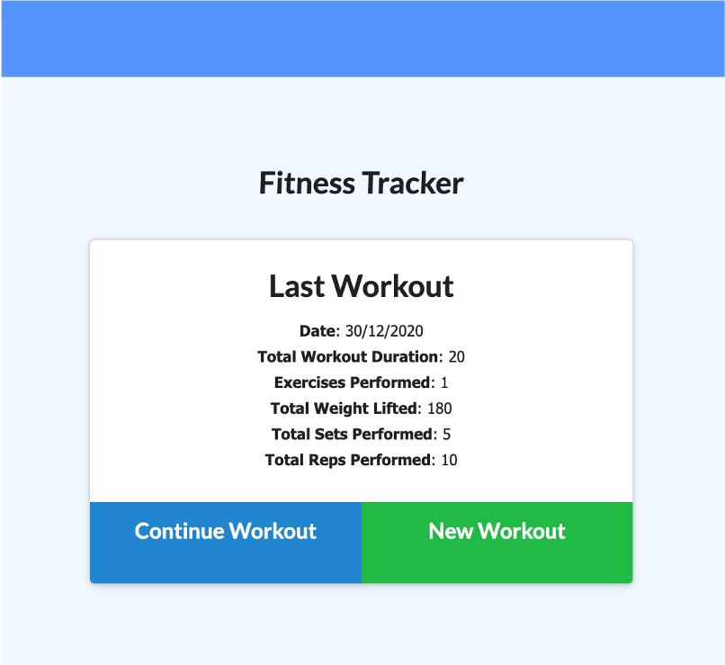
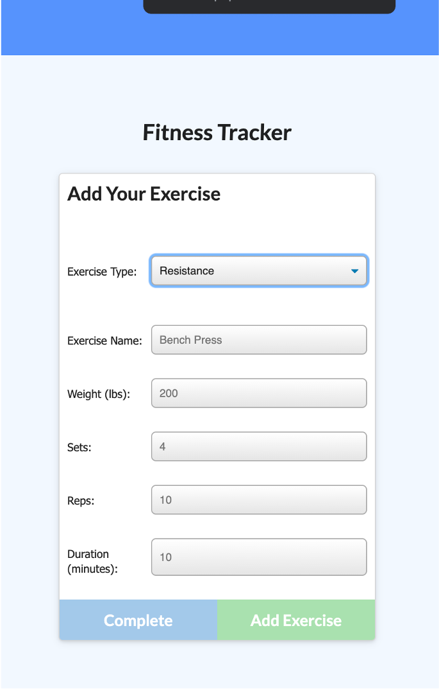
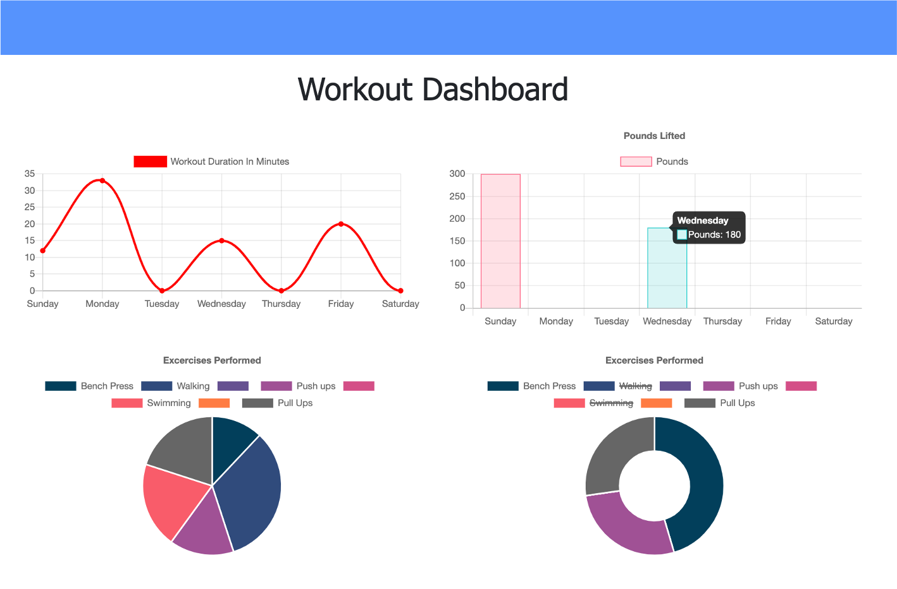

# FitnessTracker
NoSQL tool for recording and reporting exercise

## Description
FitnessTracker is an online app for recording exercise. Users can add each activity they complete to create an online record of both cardio and resistance-based exercise.  The app also includes a dashbord view, allowing users to track the amount of exercise they are doing over time.

## Motivation
Keeping fit and healthy requires a balance of steadily increasing physical activity and plenty of rest.  FitnessTracker enables users to log all their activity, as well as their rest days.  This ensures users are following the best possible path to fitness.

## Screenshots







## Build status
Minimum Viable Product. Ready for use, but requiring further testing and feedback.

## Key technologies
Javascript
SQL and Sequelize
Handlebars
Node Experess

## Code Example
```const workoutTypeSelect = document.querySelector("#type");
const cardioForm = document.querySelector(".cardio-form");
const resistanceForm = document.querySelector(".resistance-form");
const cardioNameInput = document.querySelector("#cardio-name");
const nameInput = document.querySelector("#name");
const weightInput = document.querySelector("#weight");
const setsInput = document.querySelector("#sets");
const repsInput = document.querySelector("#reps");
const durationInput = document.querySelector("#duration");
const resistanceDurationInput = document.querySelector("#resistance-duration");
const distanceInput = document.querySelector("#distance");
const completeButton = document.querySelector("button.complete");
const addButton = document.querySelector("button.add-another");
const toast = document.querySelector("#toast");
const newWorkout = document.querySelector(".new-workout")

let workoutType = null;
let shouldNavigateAway = false;

async function initExercise() {
  let workout;

  if (location.search.split("=")[1] === undefined) {
    workout = await API.createWorkout()
    console.log(workout)
  }
  if (workout) {
    location.search = "?id=" + workout._id;
  }
}

initExercise();

function handleWorkoutTypeChange(event) {
  workoutType = event.target.value;

  if (workoutType === "cardio") {
    cardioForm.classList.remove("d-none");
    resistanceForm.classList.add("d-none");
  } else if (workoutType === "resistance") {
    resistanceForm.classList.remove("d-none");
    cardioForm.classList.add("d-none");
  } else {
    cardioForm.classList.add("d-none");
    resistanceForm.classList.add("d-none");
  }
  validateInputs();
}```

## Installation
Requires NPM, otherwise working on Heroku